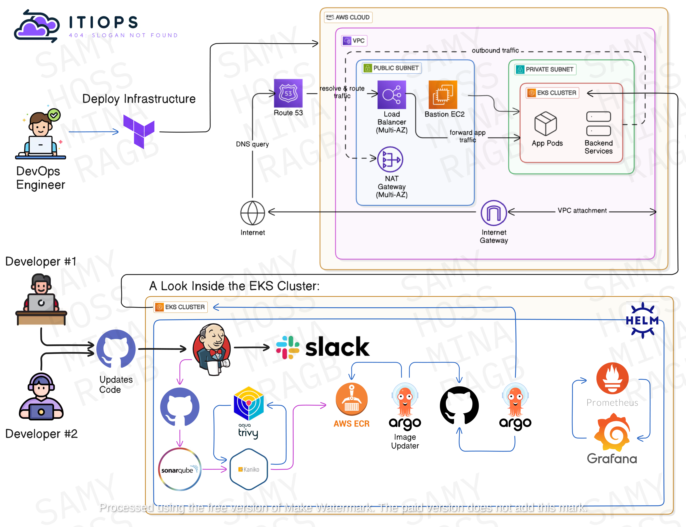

# ITIOPS: CLOUDSUITEx - APPLICATION

---

> **Team:** ITIOPS
> ---
> **Project:** CLOUDSUITEx - APPLICATION

---

## ✨ Collaborators 

<table>
  <tr>
    <td align="center">
      <a href="https://www.linkedin.com/in/hossammahmoudatta/">
         
        <b>Hossam Mahmoud</b>
      </a>
    </td>
    <td align="center">
      <a href="https://www.linkedin.com/in/mina-safwat5/">
         
        <b>Mina Safwat</b>
      </a>
    </td>
    <td align="center">
      <a href="https://www.linkedin.com/in/mahmoud-samy-301b0b196/">
         
        <b>Mahmoud Samy</b>
      </a>
    </td>
    <td align="center">
      <a href="https://www.linkedin.com/in/mohamed-0mourad/">
         
        <b>Mohammed Mourad</b>
      </a>
    </td>
  </tr>
</table>

---

### 🔗 Related Repositories

- [💻 Application Source Code](https://github.com/hosseldin/ITIOPS.CLOUDSUITEx-APPLICATION)
- [🛠 Infrastructure Repo](https://github.com/hosseldin/ITIOPS.CLOUDSUITEx-INFRASTRUCTURE)
- [🚀 Deployment Manifests (GitOps)](https://github.com/mina-safwat-1/ITIOPS.CLOUDSUITEx-DEPLOYMENT)

---

## 🚀 Project Overview

**Objective:** Provision and deploy a secure AWS infrastructure and CI/CD pipeline. Deploy a Node.js web application with MySQL and Redis, integrate security scanning, and set up monitoring and alerting.

**Key Features:**

* Infrastructure as Code with Terraform
* Continuous Integration with Jenkins
* GitOps-driven Continuous Delivery via ArgoCD & Argo Image Updater
* Secrets Management using External Secrets Operator & AWS Secrets Manager
* Security Scanning with Trivy
* Monitoring & Visualization using Prometheus & Grafana
* Ingress & HTTPS using Amazon Route 53 and AWS Certificate Manager (ACM)

---

## 🏗 Architecture Diagram

---

*Developed with ❤️ by ITIOPS Team*

## ✨ Collaborators 

<table>
  <tr>
    <td align="center">
      <a href="https://www.linkedin.com/in/hossammahmoudatta/">
         
        <b>Hossam Mahmoud</b>
      </a>
    </td>
    <td align="center">
      <a href="https://www.linkedin.com/in/mina-safwat5/">
         
        <b>Mina Safwat</b>
      </a>
    </td>
    <td align="center">
      <a href="https://www.linkedin.com/in/mahmoud-samy-301b0b196/">
         
        <b>Mahmoud Samy</b>
      </a>
    </td>
    <td align="center">
      <a href="https://www.linkedin.com/in/mohamed-0mourad/">
         
        <b>Mohammed Mourad</b>
      </a>
    </td>
  </tr>
</table>

 
